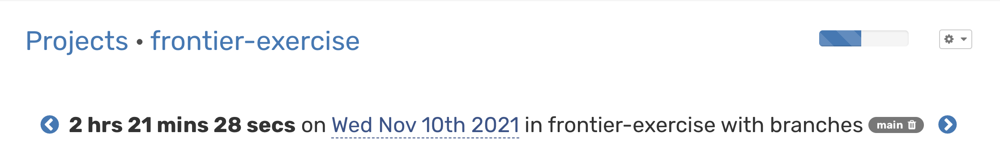
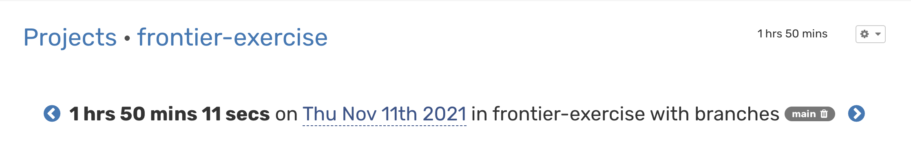

# Frontier RPA Exercise

My attempt at the Exercise [here](https://github.com/BeFrontier/frontier-rpa-exercise)

## Content

- [Tools](#Tools)
- [How to Setup](#Setup)
- [Testing](#testing)
- [Architecture](#architecture)
- [Endpoints](#endpoints)
- [Thoughts on Test](#thoughts)

# Tools 🪛

**Server:** Node, Express \
**Headless Browser:** Puppeteer

# Setup

- Clone repo
- Install all dependencies, run `yarn` .
- Create a `.env` file in the root repository and set all required variables (ie. **PORT**)
- Create an `assets` folder inside of the `src` folder
- Start project by running `yarn start`

# Testing

- Set up `jest.config.js` to suit you

```js
module.exports = {
  preset: "ts-jest",
  testEnvironment: "node",
  transformIgnorePatterns: ["^.+\\.js$"],
  testPathIgnorePatterns: ["<rootDir>/build"],
};
```

- Run `yarn test`

# Demo

Demo of RPA at work


# Architecture


- **Synchronous Pattern** \
  Hit API endpoint with payload, request is processed and response is sent to the API user accorndingly.
- **Asynchronous Pattern** \
  Hit API with payload, response `application queued` sent to the API user, worker in the background Submits Jobs and then Updates the API user with new response accordingly.

# Logs

There are two log groups found in the root directory

- `rpabot.log` - for logs related to the RPA submission
- `server.log` - for logs related to the server

# API

## Enpoint

`POST /forms/frontier/applications`

## Payload

```json
{
  "firstname": "Test",
  "lastname": "Lastname",
  "phone": "+1 234 234 0000",
  "location": "London, UK",
  "linkedin": "linkedin.com/profile/me",
  "resume": "https://frontier-public-assets.s3-us-west-2.amazonaws.com/05oo7evmr4hsc7ufvmdcpojlh1ki1rd3benjo0g1_Brian_CV.docx",
  "email": "yupp@test.com",
  "worked_remote": "No",
  "worked_startup": "No"
}
```

## Expected Response

```json
{
  "status": true,
  "message": "application submitted"
}

//or something of this structure
```

# Thoughts

- **Overview :**
  This was an interesting challenge, albeit straightforward it was interesting to tackle and see what decisions I will make. (Definetely a lot of optimizations here and there but this is enough for a client to use)

- **Challenges :**
  Working out a solution for the Google Location Field on the form. That took +50% of the time spent on this
- **Improvements ?:**
  None.

- **Suggestions :**
  This may be for a more full stack role but a test where the candidate will mock The form provided (given freedom of design choices), and create an RPA pipeline to submit to the Frontier Form. (This way FE skills can be tested too)

# Time Spent

It took approximately 6hrs to get a stable working solution with 3 (~2hr) sessions



